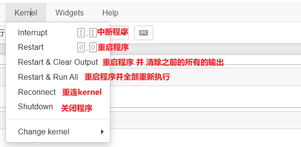

# 0-LLM学习环境配置

## 1、Anaconda安装配置

* 什么是Anaconda？

  ​​
* 下载安装`Anaconda3-2022.10-Windows-x86_64`​（**统一一下版本，方便后续有问题好排查**），安装引导无脑next就好。

  * 安装包下载地址：[Index of /anaconda/archive/ | 清华大学开源软件镜像站 | Tsinghua Open Source Mirror](https://mirrors.tuna.tsinghua.edu.cn/anaconda/archive/)
  * Anaconda和Python版本对应表（了解）

    |Anaconda3版本|Python|
    | --------------------| ---------------|
    |Anaconda 2024.06-1|Python 3.12.4|
    |Anaconda 2023.07-0|Python 3.11.3|
    |Anaconda 2023.03-0|Python 3.10.9|
    |Anaconda 2022.10|Python 3.9|
    |Anaconda 2020.07|Python 3.8.3|
    |Anaconda 2020.02|Python 3.7|
  * Anaconda历史发布记录：[Anaconda release notes — Anaconda documentation](https://docs.anaconda.com/anaconda/release-notes/) (了解)
* 安装完成后开始菜单应该会有这些，日后常用的就红框中的两个工具

  * ​`Anaconda Prompt (anaconda3)`​: 命令行工具
  * ​`Jupyter Notebook (anaconda3)`​：编写和演示代码工具

  ​​
* conda 环境介绍：安装完anaconda后，默认有一个base环境，刚开始学就用base环境就ok了。如果之后有别的需要，比如想换一个python版本，可以考虑创建一个新的conda环境（可以想象成一个新的虚拟机）

  ​​

  ```bash
  # 创建一个python3.11的新环境
  # conda create --name [自定义名称] python=[python版本]
  conda create --name py311 python=3.11

  # 激活新的环境 conda activate [环境名]
  conda activate py311

  # 查看所有环境
  conda env list

  # 删除环境
  conda remove --name py311 --all
  ```

  ​​

## 2、使用pip进行包管理

> Q: 为什么使用pip而不是anaconda自带的conda包管理工具？
>
> A: （1）感觉pip用得更多，很多Python项目的README文档中都是用pip进行依赖包的安装；（2）pip更简短

* 配置国内包的镜像源：打开Anaconda Prompt (anaconda3)，输入下列命令

  ```bash
  # 配置清华镜像源
  pip config set global.index-url https://pypi.tuna.tsinghua.edu.cn/simple
  ```

  ​​

  ```bash
  # 检查是否配置成功
  pip config list
  ```

  ​​
* Pypi仓库：[PyPI · The Python Package Index](https://pypi.org/)
* pip常用命令

  ```bash
  # 安装包（会自动安装最新的版本）
  pip install package_name
  # 安装指定版本的包
  pip install package_name==version
  # 升级包
  pip install --upgrade package_name
  # 卸载包
  pip uninstall package_name
  # 查看已安装的软件包
  pip list
  # 搜索软件包
  # pip search package_name
  ```

## 3、Jupyter Notebook快速入门

* **第一步：启动。** 运行方式有：

  （1）从开始菜单单击启动（注意，**启动后不要关闭终端**）

  （2）在Anaconda Prompt (anaconda3)中输入`jupyter notebook`​命令启动（注意，**启动后不要关闭终端**）

  ​​​​
* **第二步，登录。** 启动后会自动跳转并打开浏览器（地址 [http://localhost:8888]() ）。第一次使用可能需要输入token，**token可以在终端中找到，** 输入token后登录。**下次使用应该就不会要求输入token登录了！**

  ​​​​
* **第三步，使用。**

  * 认识主界面

  ​​

  * 新建一个新的notebook文件，文件格式：xxx.ipynb

    ​​
  * 认识代码编辑区

    ​​
  * 菜单栏介绍

    * Edit菜单：针对代码块（Cell）的一些操作

      ​​
    * kernel菜单

      ​​

      >  Q：内核是什么？
      >
      > ​​​​
      >
  * 工具栏介绍

    |图标|功能|备注|
    | -----------------------------------------------------------------------------------------------------| --------------------------------------------------------------------| ------------------------------------------------------------------|
    |​​​​​​​​​​|保存文件||
    |​​​​​​​​​​|下方新增代码块||
    |​​​​​​​​​​|剪切、复制、粘贴代码块|剪切快捷键`x`​，撤销可以使用快捷键`z`​；复制快捷键`c`​，粘贴快捷键`v`​；|
    |​​​​​​​​​​|上下移动调整代码块位置||
    |​​​​​​​​​​|运行当前代码块，**执行后会自动跳转到下一个代码块**​|也可以使用快捷键`Shift+Enter`​，如果不想跳转，可以使用`Ctrl+Enter`​|
    |​​​​​​​​​​|中断内核、重启内核、重启内核并重新运行所有代码块||
    |​​​​​​​​​​|切换代码块的类型||
    |​​​​​​​​​​|快捷键||

## 4、DevAGI配置和使用

* 创建配置文件`.env`​，放到项目根目录

  ```python
  OPENAI_API_KEY="sk-xxx" # 替换成自己的key
  OPENAI_BASE_URL="https://api.fe8.cn/v1" # 已经是DevAGI的API地址了，不用改
  ```
* 安装依赖包：打开Anaconda Prompt输入下列命令

  ```bash
  pip install python-dotenv openai
  ```
  * python-dotenv：用于从 `.env`​ 文件加载环境变量到环境变量中。在开发过程中，尤其是在使用配置文件或保密信息（如 API 密钥、数据库凭据）时非常有用
  * openai：用于与 OpenAI 的 API 进行交互（最新版1.35.14）
* 第一个openai api程序

  ```python
  # 从openai库中导入OpenAI类
  from openai import OpenAI
  # 从dotenv库中导入load_dotenv和find_dotenv函数
  from dotenv import load_dotenv, find_dotenv

  # 加载环境变量文件
  load_dotenv(find_dotenv())

  # 创建一个OpenAI客户端实例
  client = OpenAI()

  # 使用客户端实例创建一个聊天补全请求
  chat_completion = client.chat.completions.create(
      messages=[
          {
              "role": "user",  # 指定消息的角色为用户
              "content": "讲个笑话",  # 用户发送的消息内容
          }
      ],
      model="gpt-3.5-turbo",  # 指定使用的模型，此处可以更换为其他模型
  )

  # 打印生成的聊天补全的第一个选择的消息内容
  print(chat_completion.choices[0].message.content)
  ```
